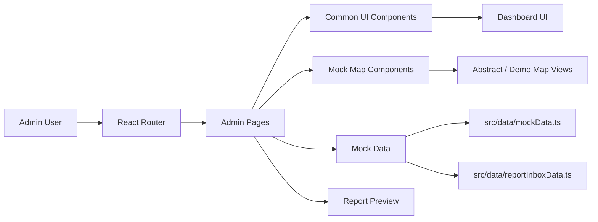

# 부산 온길 AI

<div align="center">
  
  <br />

  ### - 부산 온길 AI -
  #### 보행약자를 위한 부산형 보행 접근성 데이터 플랫폼
  <br />

  
  
  
  
  
</div>

<br />

## 🌐 Deployment

- Frontend: [https://ongil-gt67.vercel.app/admin](https://ongil-gt67.vercel.app/admin)

<br />

## ☁️ Introduction

부산 온길 AI는 부산의 경사로, 계단, 단차, 점자블록 훼손, 노면 파손 등 보행 환경 위험을 시각화하고, 행정 담당자가 개선 우선순위를 검토할 수 있도록 돕는 프론트엔드 프로토타입입니다.

현재 저장소는 스타트업 및 경진대회 발표를 위한 관리자 화면 중심의 시연용 프로젝트입니다. 모든 위험도, 온길 점수, 온길 스캔 결과, 지도 표현, 리포트 내용은 로컬 mock 데이터를 기반으로 합니다.

| 제품 영역 | 설명 |
| :---: | --- |
| 온길 스캔 | 사진 제보를 기반으로 위험 유형과 mock 신뢰도를 분류하는 화면 |
| 온길 점수 | 경사도, 계단, 단차, 점자블록, 조도, 쉼터 등을 반영한 접근성 점수 |
| 온길 대시보드 | 보행 위험 참고 구간, 제보 추이, 개선 우선순위를 확인하는 운영 대시보드 |
| 온길 리포트 | 관광지, 병원, 복지관, 행사장 주변 접근성 진단 리포트 미리보기 |
| 온길 루트 | 사용자 유형별로 상대적으로 이동이 어려운 구간을 비교하는 경로 화면 |

<br />

## 🧭 Demo Scope

- `/` 경로는 `/admin`으로 이동합니다.
- 현재 구현 범위는 관리자 대시보드 중심입니다.
- 백엔드, 데이터베이스, 인증, 실제 AI 추론, 실제 공공데이터 연동은 포함하지 않습니다.
- 실제 안전을 보장하는 표현 대신 "보행 위험 참고", "접근성 점수", "개선 우선순위"처럼 참고용 표현을 사용합니다.

| Route | 화면 | 주요 목적 |
| :--- | :--- | :--- |
| `/admin` | 온길 대시보드 | 핵심 지표, 위험도 히트맵, 개선 우선순위 요약 |
| `/admin/zones` | 위험구간 관리 | 위험 구간 목록, 점수, 담당 조치 상태 확인 |
| `/admin/reports` | 제보 관리 | 시민 제보, mock AI 분류, 검수 상태 관리 |
| `/admin/analysis` | 분석 | 위험 유형 분포, 구·군별 비교, 점수 요인 확인 |
| `/admin/photo-analysis` | AI 분석 | 사진 기반 위험 분류 mock 결과와 검수 체크리스트 |
| `/admin/routes` | 온길 루트 | 휠체어, 시각장애, 고령자, 유모차 등 사용자 유형별 경로 비교 |
| `/admin/improvements` | 개선 관리 | 개선 과제의 단계별 진행 상태 관리 |
| `/admin/field-survey` | 현장조사 일정 | 조사 배정, 체크리스트, 사용자 유형별 위험 가중치 확인 |
| `/admin/settings` | 설정 | 접근성 데이터 레이어와 운영 기준 확인 |
| `/admin/report-export` | 리포트 출력 | 행정 공유용 온길 리포트 미리보기 |

<br />

## 💻 Architecture



```text
src/
├─ components/
│  ├─ admin/          # 관리자 레이아웃
│  ├─ common/         # 공통 카드, 차트, 배지, 점수 컴포넌트
│  └─ maps/           # 시연용 지도/위험도 시각화 컴포넌트
├─ data/              # 부산 기반 mock 데이터
├─ pages/admin/       # 관리자 화면 라우트
└─ styles/            # 전역 스타일과 디자인 토큰
```

<br />

## 🛠️ Tech Stack

| Frontend | Styling | Routing & UI | Mock Data |
| :---: | :---: | :---: | :---: |
| <br /><br /> | <br /> | <br /><br /> | <br /> |

- Frontend: React, TypeScript, Vite
- Styling: Tailwind CSS, Pretendard
- Routing: React Router
- Icons: Lucide React
- Data: `src/data/mockData.ts`, `src/data/reportInboxData.ts`
- Prototype rule: local mock data only

<br />

## 🧪 Planned Technologies

아래 기술은 아이디어 제안서의 실제 서비스화 방향을 README에 정리한 예정 기술입니다. 현재 저장소에는 백엔드, 데이터베이스, 실제 AI 추론, 실제 공공데이터 연동이 포함되어 있지 않으며, 본 항목은 향후 확장 로드맵으로만 봅니다.

### Future Technical Stack

| 영역 | 후보 기술 | 적용 목적 |
| :--- | :--- | :--- |
| 공간 데이터 처리 | Python, GeoPandas, Shapely, Rasterio, PostGIS | DEM·도로망·횡단보도·편의시설 좌표를 같은 좌표계로 정규화하고 구간 단위 위험 피처 생성 |
| 경로 분석 | pgRouting, NetworkX, OSRM 후보 검토 | 최단거리뿐 아니라 계단 회피, 완만한 경사, 횡단 안전, 편의시설 접근성을 반영한 후보 경로 비교 |
| 이미지 분석 | PyTorch, Ultralytics YOLO 계열, OpenCV | 보도블록 파손, 점자블록 단절, 계단, 단차, 볼라드, 횡단보도 위험요소 객체탐지 |
| 라벨링·검수 | CVAT 또는 Label Studio, 관리자 검수 큐 | 부산 현장 사진 라벨링, confidence score 기준 검수, 오탐/중복 제보 정제 |
| API 서버 | FastAPI 또는 Spring Boot 후보 검토 | 위험구간, 온길 점수, 제보, 리포트 데이터를 프론트엔드에 제공 |
| 데이터베이스 | PostgreSQL + PostGIS | 위험구간 좌표, 보행 링크, 제보 위치, 접근성 점수, 개선 과제 저장 |
| 파일 저장소 | S3 호환 스토리지, Cloud Storage 후보 | 제보 사진, 비식별 처리 이미지, 리포트 첨부자료 저장 |
| 리포트 생성 | Python ReportLab, Playwright PDF, 서버 템플릿 | 구·군/기관 공유용 접근성 진단 리포트 PDF 생성 |
| 개인정보 보호 | 얼굴·차량번호 blur, 좌표 격자화, 최소 보관 정책 | 시민 제보 사진과 위치정보를 행정 활용 가능한 형태로 비식별화 |

| 예정 기술 | 활용 방향 | 산출물 |
| :--- | :--- | :--- |
| GIS 기반 공간분석 | DEM 고도, 도로망, 횡단보도, 신호등, 장애인 편의시설 데이터를 결합해 보행취약 후보 구간 탐지 | 급경사 지도, 완만한 대체 경로, 접근성 레이어 |
| 공공데이터 연계 | 공공데이터포털, 국가공간정보포털, 장애인편의시설 API 등으로 시설·도로·이동 수요 데이터 수집 | 구간별 위험요소 후보, 편의시설 접근성 지표 |
| 이미지 객체탐지 AI | YOLO 계열 경량 객체탐지 모델로 계단, 단차, 점자블록 단절, 보도블록 파손, 볼라드, 횡단보도 위험을 분류 | 온길 스캔 라벨, 바운딩 박스, confidence score |
| AIHub·현장 데이터 학습 | AIHub 보행 안전 도로시설물 데이터와 부산 MVP 구간 직접 촬영 이미지를 추가 라벨링 | 부산형 보행환경 이미지 데이터셋 |
| 시민제보 신뢰도 모델 | GPS 좌표, 사진 품질, 위험유형, 중복 제보, 관리자 검수 결과를 종합해 신뢰도 산정 | 중복 제보 병합, 우선 검수 대상, 위험구간 후보 |
| 접근성 점수 모델 | 규칙 기반 점수화로 시작해 경사도, 계단·단차, 횡단 안전, 노면·점자블록, 편의시설, 제보 신뢰도를 반영 | 온길 점수, 개선 필요도, 추천 이유 |
| 사용자 조건 해석 | "휠체어 이용", "계단 회피", "비 오는 날 미끄러운 길 회피" 같은 자연어를 경로탐색 변수로 변환 | 안전한 길, 계단 없는 길, 완만한 길 비교 |
| 행정 리포트 자동 요약 | 위험구간, 제보 빈도, 시설 정보, 접근성 점수 변화를 요약해 기관용 리포트 생성 | 개선 우선순위, 사진 기반 근거자료, 정책 리포트 |
| 개인정보 비식별 처리 | 제보 사진의 얼굴·차량번호 블러 처리와 개인 위치정보 최소 활용 | 행정 활용 가능한 비식별 보행환경 데이터 |

### Candidate Data Sources

| 데이터 후보 | 주요 필드/내용 | 온길 활용 방식 |
| :--- | :--- | :--- |
| [AIHub 보행 안전을 위한 도로 시설물 데이터](https://aihub.or.kr/aihubdata/data/view.do?dataSetSn=513) | 보행 안전 도로시설물 이미지 약 102.5만 장, 양호/불량 상태, 바운딩박스·세그멘테이션 라벨 | 온길 스캔 객체탐지 학습, 보도블록·점자블록·계단·볼라드 위험 라벨 기준 |
| [국토교통부 국토지리정보원 DEM](https://www.data.go.kr/data/15059920/fileData.do) | 수치표고모델, 고도 기반 지형 데이터 | 구간별 평균/최대 경사도, 급경사 지속 거리, 산복도로 위험 레이어 |
| [전국장애인편의시설표준데이터](https://www.data.go.kr/data/15100058/standard.do?recommendDataYn=Y) | 시설명, 주소, 편의시설 종류, 위치정보 | 경사로·승강기·장애인화장실 등 편의시설 접근성 레이어 |
| [한국사회보장정보원 장애인편의시설 현황 API](https://www.data.go.kr/data/15092317/openapi.do) | 시설명, 도로명, 위치정보, 보유 편의시설 목록 | 병원·복지관·관광지 주변 편의시설 점수 보정 |
| [부산광역시 신호등 설치 횡단보도 위치정보](https://www.data.go.kr/data/3072152/fileData.do) | 행정구역, 지번, 경도, 위도, 가로/세로 길이, 신호등 보유 횡단보도 3,815개 | 횡단 안전성 점수, 안전횡단 우선 경로, 위험 횡단 후보 탐지 |
| [부산교통공사 부산도시철도 장애인 편의시설 정보](https://www.data.go.kr/data/15001020/openapi.do) | 역별 휠체어리프트, 엘리베이터, 에스컬레이터, 시각장애인 유도로, 외부경사로, 장애인화장실 | 부산역·지하철역 출발/도착 경로의 대중교통 접근성 보정 |
| [부산교통공사 역사 편의시설현황](https://www.data.go.kr/data/15052664/fileData.do) | 역별 유아수유실, 휠체어리프트, 엘리베이터, 외부경사로, 유도블록 등 | 교통약자 환승·출구 선택 기준, 역 주변 온길 루트 가중치 |
| [부산시설공단 교통약자 이동지원 차량 운영현황](https://www.data.go.kr/data/15147515/fileData.do) | 출발/도착 행정동·좌표, 휠체어 이용 여부, 이동거리, 예약·배차·운행 정보 | 교통약자 이동 수요 집중 지역 분석, MVP 우선 구역 선정 참고 |
| 부산 현장조사·시민제보 데이터 | GPS 좌표, 사진, 위험유형, 설명 텍스트, 관리자 검수 상태 | 공공데이터가 놓치는 최신 위험요소 보정, 중복 제보 병합, 신뢰도 산정 |

### Accessibility Score Draft

| 점수 항목 | 예시 배점 | 근거 데이터 | 설명 |
| :--- | :---: | :--- | :--- |
| 경사도 위험 | 25 | DEM, 도로망 | 구간별 평균/최대 경사도와 급경사 지속 거리 반영 |
| 계단·단차 위험 | 20 | 현장조사, 시민제보, AI 분석 | 계단, 보도 턱, 2cm 이상 단차 등 이동 차단요인 반영 |
| 횡단 안전성 | 15 | 횡단보도, 신호등 위치정보 | 신호등 유무, 횡단거리, 교통시설 접근성 반영 |
| 노면·점자블록 상태 | 15 | 온길 스캔, 시민제보 | 파손, 단절, 마모, 장애물 점유 여부 반영 |
| 편의시설 접근성 | 15 | 장애인편의시설 API, 도시철도 편의시설 | 승강기, 화장실, 경사로, 쉼터, 역 접근성 반영 |
| 수요·민원 가능성 | 10 | 관광지·병원·복지관 위치, 제보 빈도 | 이동 수요와 중복 제보를 반영해 개선 우선순위 보정 |

### MVP Roadmap

| 단계 | 실행 내용 | 검증 기준 |
| :---: | :--- | :--- |
| 1. 지역 선정 | 감천문화마을 또는 부산역-초량이바구길-초량 산복도로 중 1개 구역 선정 | 경사·계단 밀도, 관광/생활 이동 수요, 현장조사 가능성 |
| 2. 데이터 수집 | DEM, 횡단보도, 편의시설, 도시철도 접근성, 현장 사진, 시민제보 샘플 수집 | 위험유형 6~8종 라벨 체계와 구간별 피처 테이블 구축 |
| 3. 온길 스캔 검증 | 사진 기반 객체탐지 mock에서 실제 YOLO 후보 모델로 전환 검토 | AI-관리자 검수 일치율, confidence 구간별 반려/검수/반영 기준 |
| 4. 온길 점수 산정 | 규칙 기반 접근성 점수와 사용자 유형별 가중치 적용 | 휠체어·시각장애·고령자·유모차 기준별 추천 이유 설명 가능 여부 |
| 5. 대시보드 고도화 | 위험구간 TOP10, 중복 제보, 개선 필요도, 구·군별 접근성 비교 제공 | 행정 담당자가 우선 개선 구간과 근거자료를 이해할 수 있는지 |
| 6. 리포트 실증 | 관광기관, 구청, 복지관 대상 온길 리포트 샘플 생성 | 기관 활용 의향, 시범사업 논의 가능성, 개선 항목 피드백 |

<br />

## 🚀 Getting Started

```bash
npm install
npm run dev
```

개발 서버 실행 후 브라우저에서 Vite가 안내하는 로컬 주소로 접속합니다. Windows PowerShell에서 실행 정책 때문에 `npm`이 막히면 아래처럼 실행할 수 있습니다.

```bash
npm.cmd install
npm.cmd run dev
```

<br />

## ✅ Validation

```bash
npm run build
npm run lint
```

<br />

## 👥 Member

팀원 정보와 GitHub 프로필은 프로젝트 발표 자료 정리 후 업데이트합니다.

<br />

## 💡 Commit Convention

- **Feat**: 새로운 기능 추가
- **Fix**: 버그 수정
- **Docs**: 문서 수정
- **Style**: 포매팅, 세미콜론 누락 등 기능 변경 없는 스타일 수정
- **Refactor**: 기능 변화 없는 코드 구조 개선
- **Test**: 테스트 코드 작성 또는 수정
- **Chore**: 빌드, 설정, 패키지 매니저 등 기타 작업

<br />

## 📎 Reference

- Product spec: `docs/product-spec.md`
- UI scope: `docs/ui-scope.md`
- Task plan: `docs/task-plan.md`
- Mock data: `src/data/mockData.ts`
