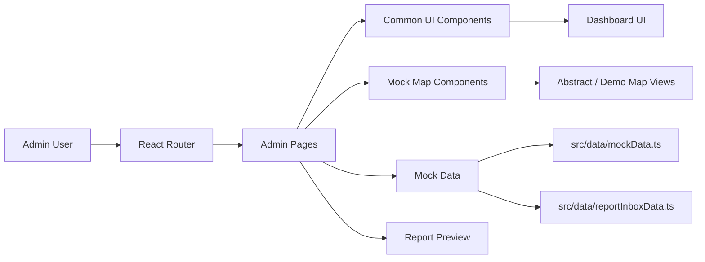

# 부산 온길 AI

<div align="center">
  
  <br />

  ### - 부산 온길 AI -
  #### 보행약자를 위한 부산형 보행 접근성 데이터 플랫폼
  <br />

  
  
  
  
  
</div>

<br />

## 🌐 Deployment

- Frontend: [https://ongil-gt67.vercel.app/admin](https://ongil-gt67.vercel.app/admin)

<br />

## ☁️ Introduction

부산 온길 AI는 부산의 경사로, 계단, 단차, 점자블록 훼손, 노면 파손 등 보행 환경 위험을 시각화하고, 행정 담당자가 개선 우선순위를 검토할 수 있도록 돕는 프론트엔드 프로토타입입니다.

현재 저장소는 스타트업 및 경진대회 발표를 위한 관리자 화면 중심의 시연용 프로젝트입니다. 모든 위험도, 온길 점수, 온길 스캔 결과, 지도 표현, 리포트 내용은 로컬 mock 데이터를 기반으로 합니다.

| 제품 영역 | 설명 |
| :---: | --- |
| 온길 스캔 | 사진 제보를 기반으로 위험 유형과 mock 신뢰도를 분류하는 화면 |
| 온길 점수 | 경사도, 계단, 단차, 점자블록, 조도, 쉼터 등을 반영한 접근성 점수 |
| 온길 대시보드 | 보행 위험 참고 구간, 제보 추이, 개선 우선순위를 확인하는 운영 대시보드 |
| 온길 리포트 | 관광지, 병원, 복지관, 행사장 주변 접근성 진단 리포트 미리보기 |
| 온길 루트 | 사용자 유형별로 상대적으로 이동이 어려운 구간을 비교하는 경로 화면 |

<br />

## 🧭 Demo Scope

- `/` 경로는 `/admin`으로 이동합니다.
- 현재 구현 범위는 관리자 대시보드 중심입니다.
- 백엔드, 데이터베이스, 인증, 실제 AI 추론, 실제 공공데이터 연동은 포함하지 않습니다.
- 실제 안전을 보장하는 표현 대신 "보행 위험 참고", "접근성 점수", "개선 우선순위"처럼 참고용 표현을 사용합니다.

| Route | 화면 | 주요 목적 |
| :--- | :--- | :--- |
| `/admin` | 온길 대시보드 | 핵심 지표, 위험도 히트맵, 개선 우선순위 요약 |
| `/admin/zones` | 위험구간 관리 | 위험 구간 목록, 점수, 담당 조치 상태 확인 |
| `/admin/reports` | 제보 관리 | 시민 제보, mock AI 분류, 검수 상태 관리 |
| `/admin/analysis` | 분석 | 위험 유형 분포, 구·군별 비교, 점수 요인 확인 |
| `/admin/photo-analysis` | AI 분석 | 사진 기반 위험 분류 mock 결과와 검수 체크리스트 |
| `/admin/routes` | 온길 루트 | 휠체어, 시각장애, 고령자, 유모차 등 사용자 유형별 경로 비교 |
| `/admin/improvements` | 개선 관리 | 개선 과제의 단계별 진행 상태 관리 |
| `/admin/field-survey` | 현장조사 일정 | 조사 배정, 체크리스트, 사용자 유형별 위험 가중치 확인 |
| `/admin/settings` | 설정 | 접근성 데이터 레이어와 운영 기준 확인 |
| `/admin/report-export` | 리포트 출력 | 행정 공유용 온길 리포트 미리보기 |

<br />

## 💻 Architecture



```text
src/
├─ components/
│  ├─ admin/          # 관리자 레이아웃
│  ├─ common/         # 공통 카드, 차트, 배지, 점수 컴포넌트
│  └─ maps/           # 시연용 지도/위험도 시각화 컴포넌트
├─ data/              # 부산 기반 mock 데이터
├─ pages/admin/       # 관리자 화면 라우트
└─ styles/            # 전역 스타일과 디자인 토큰
```

<br />

## 🛠️ Tech Stack

| Frontend | Styling | Routing & UI | Mock Data |
| :---: | :---: | :---: | :---: |
| <br /><br /> | <br /> | <br /><br /> | <br /> |

- Frontend: React, TypeScript, Vite
- Styling: Tailwind CSS, Pretendard
- Routing: React Router
- Icons: Lucide React
- Data: `src/data/mockData.ts`, `src/data/reportInboxData.ts`
- Prototype rule: local mock data only

<br />

## 🚀 Getting Started

```bash
npm install
npm run dev
```

개발 서버 실행 후 브라우저에서 Vite가 안내하는 로컬 주소로 접속합니다. Windows PowerShell에서 실행 정책 때문에 `npm`이 막히면 아래처럼 실행할 수 있습니다.

```bash
npm.cmd install
npm.cmd run dev
```

<br />

## ✅ Validation

```bash
npm run build
npm run lint
```

<br />

## 👥 Member

팀원 정보와 GitHub 프로필은 프로젝트 발표 자료 정리 후 업데이트합니다.

<br />

## 💡 Commit Convention

- **Feat**: 새로운 기능 추가
- **Fix**: 버그 수정
- **Docs**: 문서 수정
- **Style**: 포매팅, 세미콜론 누락 등 기능 변경 없는 스타일 수정
- **Refactor**: 기능 변화 없는 코드 구조 개선
- **Test**: 테스트 코드 작성 또는 수정
- **Chore**: 빌드, 설정, 패키지 매니저 등 기타 작업

<br />

## 📎 Reference

- Product spec: `docs/product-spec.md`
- UI scope: `docs/ui-scope.md`
- Task plan: `docs/task-plan.md`
- Mock data: `src/data/mockData.ts`
